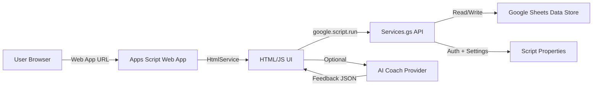

# OKRsMatter (Google Apps Script)

OKRsMatter is a lightweight OKR web app built on Google Apps Script with a Google Sheets data store. It supports executive → department → team alignment, measurable key results, weekly check-ins, rollup analytics, and an optional AI coaching panel.

---

## Architecture overview
- **Frontend**: Single-page HTML + vanilla JS (`app/client/index.html`) rendered by `HtmlService`.
- **Backend**: Apps Script services (`Services.gs`) that read/write Google Sheets.
- **Storage**: One Google Sheet with tabs matching the schema below.
- **Deployment**: Apps Script Web App (execute as user accessing the app).

## Architecture diagram


---

## Repository layout
- `Code.gs`: Web app entry point (`doGet`).
- `Services.gs`: API functions, validation, and Google Sheets access.
- `app/client/index.html`: UI, client-side logic, and rendering.
- `appsscript.json`: Apps Script manifest.
- `OKRs/`: Data import/export helpers and artifacts.
- `scripts/`: Local data processing scripts.

---

## Prerequisites
- Google Workspace account with Apps Script access
- Google Apps Script API enabled
- Node.js (for clasp)

---

## Setup (initial)
1) **Create an Apps Script project**.
2) **Enable Apps Script API**
   - Go to: `https://script.google.com/home/usersettings`
   - Turn on **Google Apps Script API**.
3) **Install clasp**
   ```bash
   npm install -g @google/clasp
   ```
4) **Authenticate clasp**
   ```bash
   clasp login
   ```
5) **Configure clasp for this repo**
   Ensure `.clasp.json` contains the correct Script ID:
   ```json
   {
     "scriptId": "<YOUR_SCRIPT_ID>",
     "rootDir": "."
   }
   ```
6) **Push code to Apps Script**
   ```bash
   clasp push -f
   ```
7) **Initialize the spreadsheet**
   In Apps Script, run:
   ```js
   setupApp()
   ```

---

## Deployment
1) Apps Script → **Deploy** → **Manage deployments**
2) Select **Web app**, then **Edit** → **New version** → **Deploy**
3) Use the Web App URL to access the UI

---

## Data schema
Tabs are created automatically by `setupApp()` and must match these headers:

- **Objectives**
  - `id, title, level, parentId, ownerEmail, ownerName, department, team, quarter, status, priority, impact, progress, description, rationale, createdAt, updatedAt`
- **KeyResults**
  - `id, objectiveId, title, metric, baseline, target, current, timeline, status, confidence, ownerEmail, updatedAt, createdAt`
- **CheckIns**
  - `id, objectiveId, keyResultId, current, confidence, notes, weekStart, ownerEmail, createdAt`
- **CoachLogs**
  - `id, objectiveId, objectiveTitle, requesterEmail, provider, model, ok, error, responseText, keyResultCount, createdAt`
- **Users**
  - `email, name, role, department, team, createdAt, updatedAt`
- **Departments**
  - `name, leadEmail`
- **Teams**
  - `name, department, leadEmail`
- **Quarters**
  - `name, start, end, status`

**Quarter name format**
- Use `Q1 2026`, `Q2 2026`, etc. The UI filters by exact string match.

---

## Script Properties
Set these in **Project Settings → Script Properties**:
- `OKR_SPREADSHEET_ID` (required) — the Google Sheet ID used as the datastore
- `OPENAI_API_KEY` (optional)
- `ANTHROPIC_API_KEY` (optional)
- `OPENAI_MODEL` (optional)
- `ANTHROPIC_MODEL` (optional)

AI settings are visible to users with roles `exec` or `operations`.

## Security & secrets hygiene
Never commit secrets or identifiers that grant access. Keep them in **Script Properties** or local `.clasp.json` only.

Do **not** commit:
- API keys or tokens
- Spreadsheet IDs or URLs
- `.clasp.json`
- OAuth credentials

Recommended practices:
- Keep `.clasp.json` in `.gitignore`
- Use `.env` files locally if needed (and ignore them)
- Review `git status` before pushing
- Avoid debug endpoints that expose script IDs or sheet URLs
---

## Data import & cleanup
Use these helper functions from `Services.gs` when migrating data:

- `normalizeImportedData()`
  - Normalizes quarter names, timelines, and progress values.
- `repairImportedData()`
  - Deduplicates objectives with the same `id`
  - Creates missing objectives for orphaned key results
  - Fills missing metrics with a default
  - Re-runs normalization

**Recommended flow**
1) Import data into the sheet
2) Run `repairImportedData()`
3) Reload the web app

---

## Performance considerations
The bootstrap payload is optimized to load objectives first and fetch KRs/check-ins afterward.
Additional improvements you can add:
- Lazy-load KRs only for visible objectives
- Add server-side filtering by quarter/department/team
- Cache rollup summaries

---

## Troubleshooting
- **Blank UI**: confirm `OKR_SPREADSHEET_ID` is set and points to the correct sheet.
- **No data rendered**: ensure quarter names match between Objectives and Quarters.
- **Still empty**: verify the web app is deployed from the correct script project and re‑deploy a new version.
- **Clasp push fails**: confirm Apps Script API is enabled.

---

## Security & access
- The app runs as the user accessing it.
- Admin functions are restricted to users with role `exec` or `operations`.
- API keys are stored in Script Properties.

---

## Recommended enhancements
- Approval workflows for alignment (exec → department → team)
- Role-based access controls for edit rights
- Data validation UI for quarterly planning
- Bulk import UI for objectives and key results
